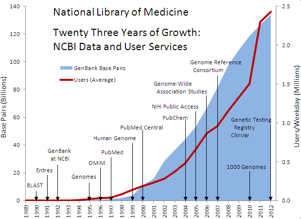

This module is a short introduction to the [National Center for Biotechnology Information](https://www.ncbi.nlm.nih.gov) - or "NCBI" for short - and an overview of the various tools available there to the public. Of these tools, we will focus mostly on BLAST - the Basic Local Alignment Search Tool. 

An outline for the module is below:

  * [What is the NCBI?](#what-is-the-ncbi)
    * [Challenge #1](#challenge-1)

***

##What is the NCBI? 

The [National Center for Biotechnology Information](https://www.ncbi.nlm.nih.gov) is an important component of the [National Library of Medicine](https://www.nlm.nih.gov) that has two broadly defined functions. First, the NCBI is tasked with hosting and maintaining a series of databases relevant to biotechnology and biomedicine. Secondly, the NCBI also serves to both curate and develop a wide variety of bioinformatics tools and services for researchers to use. We will take a better look at these two functions below. For further reading, a good overview of the history of the NCBI can be found [here](https://www.ncbi.nlm.nih.gov/books/NBK148949/). 

***

#### NCBI databases

 >Understanding nature's mute but elegant language of living cells is the quest of modern molecular biology. From an alphabet of only four letters representing the chemical subunits of DNA emerges a syntax of life processes whose most complex expression is man. The unraveling and use of this "alphabet" to form new "words and phrases" is a central focus of the field of molecular biology. The staggering volume of molecular data and its cryptic and subtle patterns have led to an absolute requirement for computerized databases and analysis tools. - *NCBI mission statement*

<kbd>
  
 </kbd>
 

 
The Explosion of Sequencing Data - <i>National Library of Medicine</i></em>

